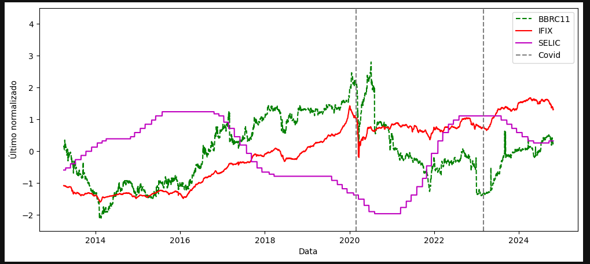
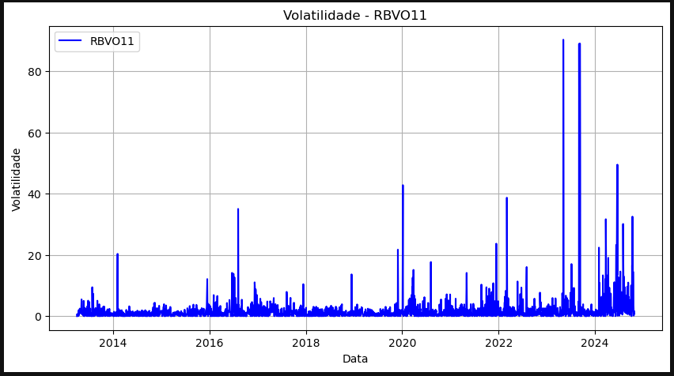
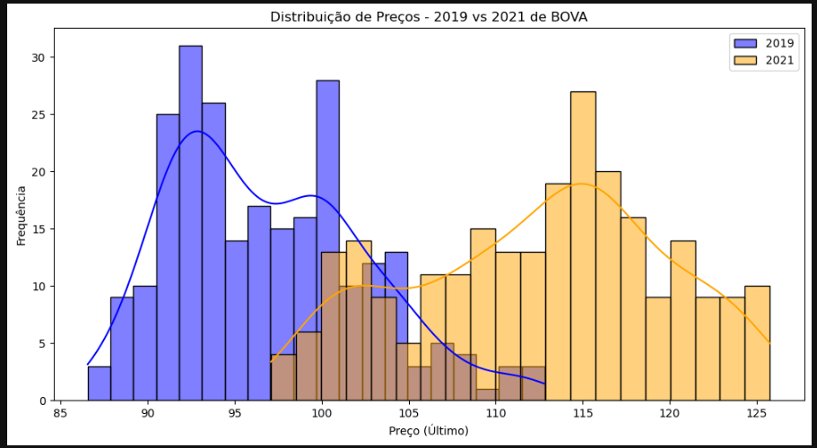
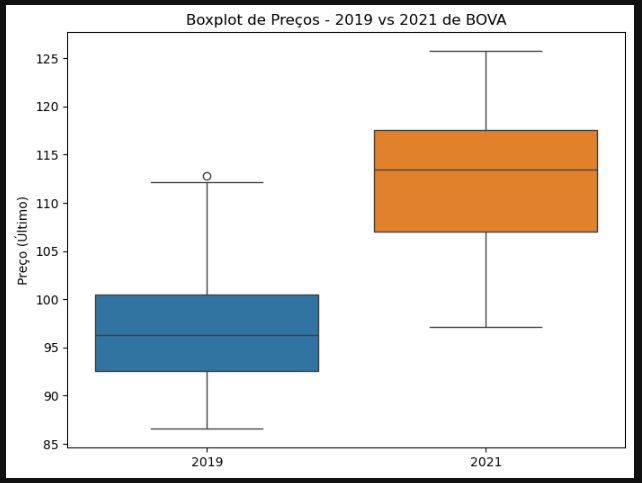
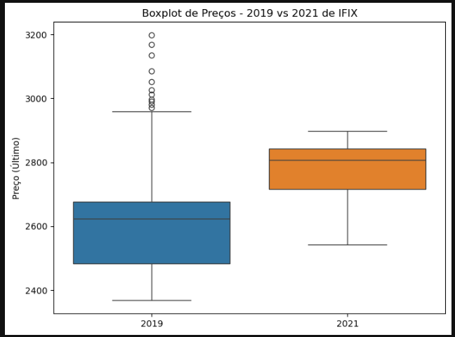
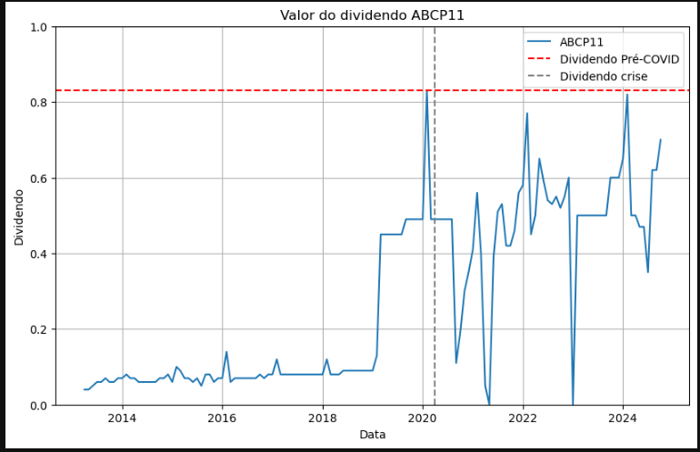

# tcc_usp
Este repositório contém o código utilizado na análise estatística de Fundos de Investimento Imobiliário (FIIs) com base nos retornos, dividendos, IFIX e taxa SELIC, separados por períodos: pré-pandemia, pandemia e pós-pandemia. O estudo inclui visualizações, regressões lineares, testes de normalidade, variância, testes t e de proporções, além de métricas como CAGR e Q². A análise visa compreender o impacto da pandemia e das variáveis macroeconômicas sobre os FIIs no Brasil. O código é escrito em Python, utilizando bibliotecas como pandas, statsmodels, matplotlib e scipy.

As datas utilizadas como período de pandemia são: 28/02/2020 a 03/03/2023

## Normalização dos dados
Fiis de papel normalizado com ifix e selic

Fii KNCR11 de papel normalizado com ifix e selic

Fii RBVO11 de papel normalizado com ifix e selic

Fii VRTA11 de papel normalizado com ifix e selic

Fiis híbrido normalizado com ifix e selic

Fii KNRI11 híbrido normalizado com ifix e selic

Fii JSRE11 híbrido normalizado com ifix e selic

Fii MXRF11 híbrido normalizado com ifix e selic

Fiis de tijolo normalizado com ifix e selic

Fii ABCP11 de tijolo normalizado com ifix e selic

Fii BBRC11 de tijolo normalizado com ifix e selic

Fii SPTW 11de tijolo normalizado com ifix e selic

## Cálculos

### Correlação com IFIX e SELIC
#### IFIX
| Tipo de ativo | Nome do ativo | Geral | Pré-Pandemia | Pandemia | Pós-Pandemia |
| :---: | :---: | :---: | :---: | :---: | :---: |
| Papel | KNCR11 | -0,3254 | 0,2574| -0,2806 | 0,8193 |
| Papel | RBVO11 | -0,9264 | -0,9217 | -0,4026 | 0,5254 |
| Papel | VRTA11 | -0,3397 | 0,2994 | -0,4301 | 0,9061 |
| Híbrido | KNRI11 | 0,5650 | 0,8110 | -0,1739 | 0,9151 |
| Híbrido | JSRE11 | -0,3250 | 0,5752 | -0,0509 | 0,5504 |
| Híbrido | MXRF11 | 0,9704 | 0,9800 | -0,1242 | 0,9286 |
| Tijolo | ABCP11 | 0,6322 | 0,9664 | -0,2752 | 0,7930 |
| Tijolo | BBRC11 | 0,4498 | 0,9475 | -0,1617 | 0,8999 |
| Tijolo | SPTW11 | -0,5468 | 0,4941 | -0,3659 | 0,9521 |

#### SELIC
| Tipo de ativo | Nome do ativo | Geral | Pré-Pandemia | Pandemia | Pós-Pandemia |
| :---: | :---: | :---: | :---: | :---: | :---: |
| Papel | KNCR11 | 0,2241 | 0,1666 | -0,0815 | -0,9579 |
| Papel | RBVO11 | 0,1977 | 0,5965 | -0,8645 | -0,7221 |
| Papel | VRTA11 | -0,1630 | 0,0126 | -0,6750 | -0,8040 |
| Híbrido | KNRI11 | -0,5333 | -0,7269 | -0,7371 | -0,6321 |
| Híbrido | JSRE11 | -0,3589 | -0,3127 | -0,8633 | -0,0082 |
| Híbrido | MXRF11 | -0,4008 | -0,6860 | -0,7379 | -0,7838 |
| Tijolo | ABCP11 | -0,5709 | -0,7300 | 0,5696 | -0,7582 |
| Tijolo | BBRC11 | -0,6135 | -0,7054 | -0,6033 | -0,8180 |
| Tijolo | SPTW11 | -0,3097 | -0,6365 | -0,7508 | -0,8669 |

### Retorno e Volatilidade

#### Retorno
| Tipo de ativo | Nome do ativo | Pré-Pandemia | Pandemia | Pós-Pandemia |
| :---: | :---: | :---: | :---: | :---: |
| Papel | KNCR11 | 0,000034 | -0,000120 | 0,000794 |
| Papel | RBVO11 | -0,000818 | -0,000878 | 0,00569 |
| Papel | VRTA11 | 0,000171 | -0,000626 | 0,000435 |
| Híbrido | KNRI11 | 0,000070 | -0,000361 | 0,000397 |
| Híbrido | JSRE11 | 0,000023 | -0,000717 | 0,000316 |
| Híbrido | MXRF11 | 0,000488 | -0,000097 | 0,000502 |
| Tijolo | ABCP11 | 0,001090 | -0,000712 | 0,000911 |
| Tijolo | BBRC11 | 0,000293 | -0,000793 | 0,001000 |
| Tijolo | SPTW11 | 0,000161 | -0,000938 | 0,000551 |

#### Volatilidade
| Tipo de ativo | Nome do ativo | Pré-Pandemia | Pandemia | Pós-Pandemia |
| :---: | :---: | :---: | :---: | :---: |
| Papel | KNCR11 | 0,010406 | 0,011056 | 0,019066 |
| Papel | RBVO11 | 0,024491 | 0,031888 | 0,107201 |
| Papel | VRTA11 | 0,011412 | 0,014344 | 0,017904 |
| Híbrido | KNRI11 | 0,012858 | 0,013105 | 0,013578 |
| Híbrido | JSRE11 | 0,013597  | 0,013399 | 0,016921 |
| Híbrido | MXRF11 | 0,009537 | 0,011724 | 0,019352 |
| Tijolo | ABCP11 | 0,026823 | 0,016180 | 0,018101 |
| Tijolo | BBRC11 | 0,014396 | 0,016678 | 0,0197735 |
| Tijolo | SPTW11 | 0,015246 | 0,025077 | 0,021162 |

### Média mensal por ano

Fii ABCP11 Média mensal por ano

Fii BBRC11 Média mensal por ano

BOVESPA Média mensal por ano

IFIX Média mensal por ano

Fii JSRE11 Média mensal por ano

Fii KNCR11 Média mensal por ano

Fii KNRI11 Média mensal por ano

Fii MXRF11 Média mensal por ano

Fii RBVO11 Média mensal por ano

Fii SPTW11 Média mensal por ano

Fii VRTA11 Média mensal por ano

### Volatilidade

Fii ABCP11 Volatilidade

Fii BBRC11 Volatilidade

BOVA Volatilidade

IFIX Volatilidade

Fii JSRE11 Volatilidade

Fii KNCR11 Volatilidade

Fii KNRI11 Volatilidade

Fii MXRF11 Volatilidade

Fii RBVO11 Volatilidade

Fii SPTW11 Volatilidade

Fii VRTA11 Volatilidade

#### Volatilidade intradiária

Fii ABCP11 Volatilidade intradiária

Fii BBRC11 Volatilidade intradiária

BOVA Volatilidade intradiária

IFIX Volatilidade intradiária

Fii JSRE11 Volatilidade intradiária

Fii KNCR11 Volatilidade intradiária

Fii KNRI11 Volatilidade intradiária

Fii MXRF11 Volatilidade intradiária

Fii RBVO11 Volatilidade intradiária

Fii SPTW11 Volatilidade intradiária

Fii VRTA11 Volatilidade intradiária

### Assimetria e curtose

Curtose (Kurtosis)
A curtose mede o grau de concentração dos dados nas caudas da distribuição em relação a uma distribuição normal. Em outras palavras, ela avalia se os dados têm mais ou menos valores extremos (outliers).

Curtose ≈ 3:
- Distribuição mesocúrtica, como a normal.
- Caudas e pico moderados, padrão de referência.

Curtose > 3:
- Distribuição leptocúrtica (alta curtose).
- Tem caudas mais pesadas e um pico mais agudo.
- Indica maior frequência de valores extremos.
- Pode sugerir maior risco ou instabilidade em séries financeiras.

Curtose < 3:
- Distribuição platicúrtica (baixa curtose).
- Tem caudas mais leves e um pico mais achatado.
- Indica menos valores extremos, distribuição mais "espalhada".

Em Python (como com `scipy.stats.kurtosis`), por padrão, a curtose é excesso de curtose, ou seja, o valor retornado subtrai 3. Assim:
- Valor 0 → mesocúrtica
- Valor > 0 → leptocúrtica
- Valor < 0 → platicúrtica

Assimetria (Skewness)
A assimetria mede o grau de distorção ou inclinação da distribuição em torno da média. Ela indica se os dados estão "puxados" para algum lado.

Assimetria ≈ 0:
- Distribuição simétrica, como a normal.
- Média ≈ Mediana ≈ Moda.

Assimetria > 0 (positiva):
- A cauda direita (valores altos) é mais longa.
- Mais valores concentrados à esquerda.
- Média > Mediana.

Assimetria < 0 (negativa):
- A cauda esquerda (valores baixos) é mais longa.
- Mais valores concentrados à direita.
- Média < Mediana.

Exemplo prático:
- Preços de FIIs com assimetria positiva: muitos valores baixos com alguns preços altos pontuais.
- Preços de FIIs com assimetria negativa: muitos valores altos, mas com alguns casos de queda acentuada.

| Tipo de ativo | Nome do ativo | Assimetria (Skewness) | Curtose (Kurtosis) |
| :---: | :---: | :---: | :---: |
| Índice | BOVA | 0,02 | -1,46 |
| Índice | IFIX | -0,13 | -1,35 |
| Papel | KNCR11 | -0,04 | -1,08 |
| Papel | RBVO11 | 0,16 | -1,54 |
| Papel | VRTA11 | 0,60 | -0,26 |
| Híbrido | KNRI11 | -0,04 | -0,38 |
| Híbrido | JSRE11 | 0,09 | -0,34 |
| Híbrido | MXRF11 | -0,24 | -1,40 |
| Tijolo | ABCP11 | 0,25 | -0,42 |
| Tijolo | BBRC11 | 0,23 | -0,77 |
| Tijolo | SPTW11 | -0,05 | -0,87 |

#### Distribuição de Preços

Fii ABCP11 Distribuição de Preços - 2019 vs 2021 - Gráfico de barras

Fii ABCP11 Distribuição de Preços - 2019 vs 2021 - Boxplot

Assimetria e curtose por ano ABCP11
| Ano | Assimetria (Skewness) | Curtose (Kurtosis) |
| :---: | :---: | :---: |
| 2013 | -0,3698 | -0,7069 |
| 2014 | -0,8283 | 1,1997 |
| 2015 | -0,0558 | -0,3494 |
| 2016 | -0,0261 | -1,5754 |
| 2017 | -0,4176 | 0,6916 |
| 2018 | -0,4226 | 0,1416 |
| 2019 | -0,0888 | -1,1132 |
| 2020 | 0,4042 | -1,0155 |
| 2021 | -0,4521 | -0,2691 |
| 2022 | 1,3123 | 0,9893 |
| 2023 | -0,2628 | -0,6998 |
| 2024 | 0,2150 | -0,8159 |

Fii BBRC11 Distribuição de Preços - 2019 vs 2021 - Gráfico de barras

Fii BBRC11 Distribuição de Preços - 2019 vs 2021 - Boxplot

Assimetria e curtose por ano BBRC11
| Ano | Assimetria (Skewness) | Curtose (Kurtosis) |
| :---: | :---: | :---: |
| 2013 | 0,1764 | -0,9449 |
| 2014 | -0,3570 | -1,1772 |
| 2015 | -0,1773 | -1,2363 |
| 2016 | 0,0740 | -1,2432 |
| 2017 | 0,2533 | -1,3659 |
| 2018 | -0,8286 | -0,4184 |
| 2019 | 0,6810 | -0,1494 |
| 2020 | 0,0421 | -1,4225 |
| 2021 | -0,7040 | 1,0045 |
| 2022 | 0,0011 | -1,5429 |
| 2023 | 0,0757 | -1,5429 |
| 2024 | 0,2665 | -1,0342 |

BOVA Distribuição de Preços - 2019 vs 2021 - Gráfico de barras

BOVA Distribuição de Preços - 2019 vs 2021 - Boxplot

Assimetria e curtose por ano BOVA
| Ano | Assimetria (Skewness) | Curtose (Kurtosis) |
| :---: | :---: | :---: |
| 2013 | -0,5187 | -0,5942 |
| 2014 | 0,1268 | -0,6589 |
| 2015 | 0,3045 | -0,8417 |
| 2016 | -0,5779 | -0,5569 |
| 2017 | 0,4145 | -1,2423 |
| 2018 | -0,5317 | -0,7450 |
| 2019 | 0,5527 | -0,2581 |
| 2020 | -0,4699 | -0,5386 |
| 2021 | -0,2011 | -0,8827 |
| 2022 | -0,4237 | -0,4031 |
| 2023 | 0,2402 | -0,3341 |
| 2024 | 0,0245 | -0,0874 |

IFIX Distribuição de Preços - 2019 vs 2021 - Gráfico de barras

IFIX Distribuição de Preços - 2019 vs 2021 - Boxplot

Assimetria e curtose por ano IFIX
| Ano | Assimetria (Skewness) | Curtose (Kurtosis) |
| :---: | :---: | :---: |
| 2013 | 0,8425 | -0,8363 |
| 2014 | -0,8118 | 0,3665 |
| 2015 | -0,2691 | -1,1541 |
| 2016 | -0,3667 | -1,2247 |
| 2017 | 0,0006 | -0,7144 |
| 2018 | -0,0895 | -1,4287 |
| 2019 | 0,8988 | 0,5796 |
| 2020 | -0,0661 | 1,0190 |
| 2021 | -0,7181 | -0,2276 |
| 2022 | 0,7018 | -0,8477 |
| 2023 | -0,3869 | -1,5808 |
| 2024 | -1,3915 | 2,2019 |

Fii JSRE11 Distribuição de Preços - 2019 vs 2021 - Gráfico de barras

Fii JSRE11 Distribuição de Preços - 2019 vs 2021 - Boxplot

Assimetria e curtose por ano JSRE11
| Ano | Assimetria (Skewness) | Curtose (Kurtosis) |
| :---: | :---: | :---: |
| 2013 | 1,2107 | 0,1778 |
| 2014 | 2,6978 | 6,198 |
| 2015 | -0,1846 | -1,6257 |
| 2016 | -0,5447 | -0,7208 |
| 2017 | 0,8319 | -0,0369 |
| 2018 | -0,0203 | -0,1275 |
| 2019 | 0,6889 | 0,4245 |
| 2020 | 1,2446 | 1,0693 |
| 2021 | -0,5616 | -0,7310 |
| 2022 | 0,0663 | 1,1726 |
| 2023 | -0,4366 | -1,2276 |
| 2024 | 0,1283 | -1,4186 |

Fii KNCR11 Distribuição de Preços - 2019 vs 2021 - Gráfico de barras

Fii KNCR11 Distribuição de Preços - 2019 vs 2021 - Boxplot

Assimetria e curtose por ano KNCR11
| Ano | Assimetria (Skewness) | Curtose (Kurtosis) |
| :---: | :---: | :---: |
| 2013 | 0,3734 | -0,3949 |
| 2014 | 0,3015 | 0,2496 |
| 2015 | 0,2793 | -1,1152 |
| 2016 | -0,2199 | -0,9223 |
| 2017 | 1,7241 | 1,2408 |
| 2018 | -0,4335 | -0,6914 |
| 2019 | -0,3784 | 0,0092 |
| 2020 | 0,9033 | 0,0499 |
| 2021 | 0,4668 | -0,7418 |
| 2022 | 2,6363 | 5,3922 |
| 2023 | 0,5741 | -0,8671 |
| 2024 | -0,0113 | -1,3896 |

Fii KNRI11 Distribuição de Preços - 2019 vs 2021 - Gráfico de barras

Fii KNRI11 Distribuição de Preços - 2019 vs 2021 - Boxplot

Assimetria e curtose por ano KNRI11
| Ano | Assimetria (Skewness) | Curtose (Kurtosis) |
| :---: | :---: | :---: |
| 2013 | 0,7420 | -1,0394 |
| 2014 | 0,3326 | -1,2312 |
| 2015 | -0,4537 | -1,0647 |
| 2016 | -0,5575 | -0,8744 |
| 2017 | 0,2182 | -1,6743 |
| 2018 | -0,1082 | -0,8184 |
| 2019 | 1,6567 | 2,1996 |
| 2020 | 0,6682 | -0,4234 |
| 2021 | 0,1963 | -0,9355 |
| 2022 | -0,0047 | -1,5103 |
| 2023 | -0,4211 | -1,3666 |
| 2024 | -1,4577 | 1,1645 |

Fii MXRF11 Distribuição de Preços - 2019 vs 2021 - Gráfico de barras

Fii MXRF11 Distribuição de Preços - 2019 vs 2021 - Boxplot

Assimetria e curtose por ano MXRF11
| Ano | Assimetria (Skewness) | Curtose (Kurtosis) |
| :---: | :---: | :---: |
| 2013 | 0,9335 | -0,0902 |
| 2014 | -1,0284 | 0,1573 |
| 2015 | -0,6021 | -1,2482 |
| 2016 | -0,6212 | -1,1894 |
| 2017 | -0,8393 | -0,0330 |
| 2018 | -0,6123 | -0,8730 |
| 2019 | 1,8316 | 6,5971 |
| 2020 | 0,5785 | 0,3847 |
| 2021 | -0,3254 | -0,6895 |
| 2022 | 0,8720 | 0,5420 |
| 2023 | -0,0866 | -0,6676 |
| 2024 | 0,5811 | 7,5595 |

Fii RBVO11 Distribuição de Preços - 2019 vs 2021 - Gráfico de barras

Fii RBVO11 Distribuição de Preços - 2019 vs 2021 - Boxplot

Assimetria e curtose por ano RBVO11
| Ano | Assimetria (Skewness) | Curtose (Kurtosis) |
| :---: | :---: | :---: |
| 2013 | -0,6746 | -0,4508 |
| 2014 | 0,6077 | 0,1123 |
| 2015 | 0,4081 | 0,1380 |
| 2016 | 0,0053 | -1,1358 |
| 2017 | 0,7925 | -1,0802 |
| 2018 | 0,2225 | 1,1023 |
| 2019 | -0,2124 | 2,1599 |
| 2020 | 2,7631 | 13,2880 |
| 2021 | 0,4256 | -1,3215 |
| 2022 | 1,5550 | 0,8389 |
| 2023 | 4,6321 | 29,5003 |
| 2024 | 0,7136 | -0,0636 |

Fii SPTW11 Distribuição de Preços - 2019 vs 2021 - Gráfico de barras

Fii SPTW11 Distribuição de Preços - 2019 vs 2021 - Boxplot

Assimetria e curtose por ano SPTW11
| Ano | Assimetria (Skewness) | Curtose (Kurtosis) |
| :---: | :---: | :---: |
| 2013 | 0,1543 | -0,5872 |
| 2014 | -0,4033 | 0,1453 |
| 2015 | -0,5559 | -0,8464 |
| 2016 | 0,4528 | -0,9030 |
| 2017 | -0,0689 | -0,2811 |
| 2018 | -0,0665 | -0,7150 |
| 2019 | 1,2662 | 3,1650 |
| 2020 | 0,4867 | -0,5167 |
| 2021 | -0,4605 | -1,0868 |
| 2022 | 1,5781 | 0,8665 |
| 2023 | 0,0656 | 1,0023 |
| 2024 | -0,8954 | 1,8523 |

Fii VRTA11 Distribuição de Preços - 2019 vs 2021 - Gráfico de barras

Fii VRTA11 Distribuição de Preços - 2019 vs 2021 - Boxplot

Assimetria e curtose por ano VRTA11
| Ano | Assimetria (Skewness) | Curtose (Kurtosis) |
| :---: | :---: | :---: |
| 2013 | 0,0400 | -0,9962 |
| 2014 | 1,7664 | 3,3066 |
| 2015 | 0,4248 | -0,5960 |
| 2016 | 0,1007 | -0,6416 |
| 2017 | 0,7509 | -0,4300 |
| 2018 | 1,1112 | 0,0849 |
| 2019 | -0,4448 | -0,5580 |
| 2020 | 0,4624 | -0,8273 |
| 2021 | -1,0147 | 0,7130 |
| 2022 | 1,3128 | 0,4127 |
| 2023 | -0,0678 | -0,1991 |
| 2024 | 0,1935 | -1,0207 |

### Índice de sharpe

- Quanto maior o índice, melhor o retorno ajustado ao risco.
- Valores acima de 1 são considerados bons; acima de 2, excelentes.
- Valores negativos indicam que o ativo está performando abaixo da taxa livre de risco.

| Tipo de ativo | Nome do ativo | SELIC | BOVA | IFIX |
| :---: | :---: | :---: | :---: | :---: |
| Papel | KNCR11 | -778,3136 | -6784,7140 | 188.309,9822 |
| Papel | RBVO11 | -193,4178 | -1686,0733 | -46.797,0676 |
| Papel | VRTA11 | -713,0454 | -6215,7043 | -172.516,9077 |
| Híbrido | KNRI11 | -729,4448 | -6358,6575 | -176.484,5683 |
| Híbrido | JSRE11 | -674,8060 | -5882,2958 | -163.262,9060 |
| Híbrido | MXRF11 | -791,0203 | -6895,6324 | -191.389,0501 |
| Tijolo | ABCP11 | -411,2505 | -3585,1108 | -99.505,4285 |
| Tijolo | BBRC11 | -597,7488 | -5210,7101 | -144.623,4994 |
| Tijolo | SPTW11 | -496,0297 | -4323,9202 | -120.010,3202 |

### Desempenho relativo e acumulado em relação ao IFIX

Fii ABCP11 Desempenho relativo em relação ao IFIX

Fii ABCP11 Desempenho relativo acumulado em relação ao IFIX

Fii BBRC11 Desempenho relativo em relação ao IFIX

Fii BBRC11 Desempenho relativo acumulado em relação ao IFIX

Fii JSRE11 Desempenho relativo em relação ao IFIX

Fii JSRE11 Desempenho relativo acumulado em relação ao IFIX

Fii KNCR11 Desempenho relativo em relação ao IFIX

Fii KNCR11 Desempenho relativo acumulado em relação ao IFIX

Fii KNRI11 Desempenho relativo em relação ao IFIX

Fii KNRI11 Desempenho relativo acumulado em relação ao IFIX

Fii MXRF11 Desempenho relativo em relação ao IFIX

Fii MXRF11 Desempenho relativo acumulado em relação ao IFIX

Fii RBVO11 Desempenho relativo em relação ao IFIX

Fii RBVO11 Desempenho relativo acumulado em relação ao IFIX

Fii SPTW11 Desempenho relativo em relação ao IFIX

Fii SPTW11 Desempenho relativo acumulado em relação ao IFIX

Fii VRTA11 Desempenho relativo em relação ao IFIX

Fii VRTA11 Desempenho relativo acumulado em relação ao IFIX

### Erro padrão

| Tipo de ativo | Nome do ativo | Geral | Pré-Pandemia | Pandemia | Pós-Pandemia |
| :---: | :---: | :---: | :---: | :---: | :---: |
| Papel | KNCR11 | 0,1984 | 0,1985 | 0,1694 | 0,4067 |
| Papel | RBVO11 | 0,5674 | 0,4234 | 0,1091 | 0,2875 |
| Papel | VRTA11 | 0,2891 | 0,3492 | 0,4346 | 0,2214 |
| Híbrido | KNRI11 | 0,3718 | 0,5476 | 0,5299 | 0,4861 |
| Híbrido | JSRE11 | 0,2333 | 0,2400 | 0,3645 | 0,2405 |
| Híbrido | MXRF11 | 0,0417 | 0,0451 | 0,0232 | 0,0221 |
| Tijolo | ABCP11 | 0,3719 | 0,6179 | 0,3519 | 0,2575 |
| Tijolo | BBRC11 | 0,3834 | 0,5599 | 0,6638 | 0,5285 |
| Tijolo | SPTW11 | 0,3262 | 0,2344 | 0,4695 | 0,1440 |

### Regressão Linear

**ABCP11**

Geral
|  | coef | std err | t | P>\|t\| | \[0,025 | 0,975\] |
| :---: | :---: | :---: | :---: | :---: | :---: | :---: |
| const | -0,0005 | 0,001 | -0,457 | 0,648 | -0,003 | 0,002 |
| Retorno IFIX | 0,9630 | 0,083 | 11,556 | 0,000 | 0,800 | 1,126 |
| SELIC | 0,00006837 | 0,000 | 0,622 | 0,534 | -0,000 | 0,000 |

Pré-Pandemia
|  | coef | std err | t | P>\|t\| | \[0,025 | 0,975\] |
| :---: | :---: | :---: | :---: | :---: | :---: | :---: |
| const | -0,0002 | 0,002 | -0,112 | 0,911 | -0,004 | 0,004 |
| Retorno IFIX | 1,1176 | 0,180 | 6,213 | 0,000 | 0,765 | 1,470 |
| SELIC | 0,00008586 | 0,000 | 0,415 | 0,679 | -0,000 | 0,000 |

Pandemia
|  | coef | std err | t | P>\|t\| | \[0,025 | 0,975\] |
| :---: | :---: | :---: | :---: | :---: | :---: | :---: |
| const | -0,0010 | 0,001 | -1,073 | 0,284 | -0,003 | 0,001 |
| Retorno IFIX | 0,8947 | 0,068 | 13,112 | 0,000 | 0,761 | 1,029 |
| SELIC | 0,00004974 | 0,000 | 0,444 | 0,657 | -0,000 | 0,000 |

Pós-Pandemia 
|  | coef | std err | t | P>\|t\| | \[0,025 | 0,975\] |
| :---: | :---: | :---: | :---: | :---: | :---: | :---: |
| const | 0,0075 | 0,007 | 1,138 | 0,256 | -0,005 | 0,020 |
| Retorno IFIX | -0,8774 | 0,250 | 3,510 | 0,000 | 0,386 | 1,369 |
| SELIC | -0,0007 | 0,001 | -1,211 | -0,226 | -0,002 | 0,000 |

**BBRC11**

Geral
|  | coef | std err | t | P>\|t\| | \[0,025 | 0,975\] |
| :---: | :---: | :---: | :---: | :---: | :---: | :---: |
| const | -0,0007 | 0,001 | -0,975 | 0,329 | -0,002 | 0,001 |
| Retorno IFIX | 0,8517 | 0,053 | 16,099 | 0,000 | 0,748 | 0,955 |
| SELIC | 0,00004362 | 0,0000703 | 0,620 | 0,535 | 0,000943 | 0,000 |

Pré-Pandemia
|  | coef | std err | t | P>\|t\| | \[0,025 | 0,975\] |
| :---: | :---: | :---: | :---: | :---: | :---: | :---: |
| const | -0,0006 | 0,0001 | -0,530 | 0,596 | -0,003 | 0,002 |
| Retorno IFIX | 0,776 | 0,090 | 8,541 | 0,000 | 0,590 | 0,942 |
| SELIC | 0,00006037 | 0,000 | 0,563 | 0,574 | -0,000 | 0,000 |

Pandemia
|  | coef | std err | t | P>\|t\| | \[0,025 | 0,975\] |
| :---: | :---: | :---: | :---: | :---: | :---: | :---: |
| const | -0,0009 | 0,001 | -0,919 | 0,358 | -0,003 | 0,001 |
| Retorno IFIX | 0,9142 | 0,070 | 12,971 | 0,000 | 0,776 | 1,053 |
| SELIC | 0,00003226 | 0,0000 | 0,279 | 0,780 | -0,000 | 0,000 |

Pós-Pandemia
|  | coef | std err | t | P>\|t\| | \[0,025 | 0,975\] |
| :---: | :---: | :---: | :---: | :---: | :---: | :---: |
| const | 0,0024 | 0,007 | 0,375 | 0,708 | -0,010 | 0,015 |
| Retorno IFIX | 0,6236 | 0,248 | 2,517 | 0,012 | 0,137 | 1,111 |
| SELIC | -0,0003 | 0,001 | -0,464 | 0,643 | -0,001 | 0,001 |

**JSRE11**

Geral
|  | coef | std err | t | P>\|t\| | \[0,025 | 0,975\] |
| :---: | :---: | :---: | :---: | :---: | :---: | :---: |
| const | -0,0004 | 0,001 | -0,687 | 0,492 | -0,002 | 0,001 |
| Retorno IFIX | 0,9584 | 0,047 | 20,378 | 0,000 | 0,866 | 1,051 |
| SELIC | -0,000008513 | 0,0000623 | -0,317 | 0,891 | -0,000 | 0,000 |

Pré-Pandemia
|  | coef | std err | t | P>\|t\| | \[0,025 | 0,975\] |
| :---: | :---: | :---: | :---: | :---: | :---: | :---: |
| const | -0,0004 | 0,001 | -0,407 | 0,684 | -0,002 | 0,002 |
| Retorno IFIX | 0,8566 | 0,085 | 10,105 | 0,000 | 0,690 | 1,023 |
| SELIC | 0,00001077 | 0,000 | 0,107 | 0,915 | -0,000 | 0,000 |

Pandemia
|  | coef | std err | t | P>\|t\| | \[0,025 | 0,975\] |
| :---: | :---: | :---: | :---: | :---: | :---: | :---: |
| const | -0,0005 | 0,001 | -0,627 | 0,531 | -0,002 | 0,001 |
| Retorno IFIX | 0,9751 | 0,052 | 18,921 | 0,000 | 0,874 | 1,076 |
| SELIC | 0,00003114 | 0,0000846 | -0,368 | 0,713 | -0,000 | 0,000 |

Pós-Pandemia
|  | coef | std err | t | P>\|t\| | \[0,025 | 0,975\] |
| :---: | :---: | :---: | :---: | :---: | :---: | :---: |
| const | 0,0009 | 0,006 | 0,150 | 0,881 | -0,011 | 0,013 |
| Retorno IFIX | 1,4365 | 0,238 | 6,041 | 0,000 | 0,969 | 1,904 |
| SELIC | -0,0002 | 0,001 | -0,320 | 0,749 | -0,001 | 0,001 |

**KNCR11**

Geral
|  | coef | std err | t | P>\|t\| | \[0,025 | 0,975\] |
| :---: | :---: | :---: | :---: | :---: | :---: | :---: |
| const | 0,00004093 | 0,001 | 0,077 | 0,938 | -0,001 | 0,001 |
| Retorno IFIX | 0,6017 | 0,039 | 15,516 | 0,000 | 0,526 | 0,678 |
| SELIC | -0,0000314 | 0,0000516 | -0,609 | 0,543 | -0,000 | 0,0000697 |

Pré-Pandemia
|  | coef | std err | t | P>\|t\| | \[0,025 | 0,975\] |
| :---: | :---: | :---: | :---: | :---: | :---: | :---: |
| const | -0,0003 | 0,001 | -0,407 | 0,684 | -0,002 | 0,001 |
| Retorno IFIX | 0,5860 | 0,065 | 9,079 | 0,000 | 0,459 | 0,713 |
| SELIC | 0,00001429 | 0,0000773 | 0,185 | 0,853 | -0,000 | 0,000 |

Pandemia
|  | coef | std err | t | P>\|t\| | \[0,025 | 0,975\] |
| :---: | :---: | :---: | :---: | :---: | :---: | :---: |
| const | 0,0000008864 | 0,001 | 0,001 | 0,999 | -0,001 | 0,001 |
| Retorno IFIX | 0,6137 | 0,047 | 13,171 | 0,000 | 0,522 | 0,705 |
| SELIC | 0,00001363 | 0,0000765 | -0,178 | 0,859 | -0,000 | 0,000 |

Pós-Pandemia
|  | coef | std err | t | P>\|t\| | \[0,025 | 0,975\] |
| :---: | :---: | :---: | :---: | :---: | :---: | :---: |
| const | 0,0088 | 0,006 | 1,495 | 0,136 | -0,003 | 0,020 |
| Retorno IFIX | 0,6074 | 0,224 | 2,713 | 0,007 | 0,167 | 1,048 |
| SELIC | -0,0008 | 0,000 | -1,636 | 0,103 | -0,002 | 0,000 |

**KNRI11**

Geral
|  | coef | std err | t | P>\|t\| | \[0,025 | 0,975\] |
| :---: | :---: | :---: | :---: | :---: | :---: | :---: |
| const | -0,0006 | 0,001 | -1,054 | 0,292 | -0,002 | 0,001 |
| Retorno IFIX | 1,2139 | 0,041 | 29,953 | 0,000 | 1,134 | 1,293 |
| SELIC | 0,00001545 | 0,0000539 | 0,287 | 0,774 | -0,0000902 | 0,000 |

Pré-Pandemia
|  | coef | std err | t | P>\|t\| | \[0,025 | 0,975\] |
| :---: | :---: | :---: | :---: | :---: | :---: | :---: |
| const | -0,0006 | 0,001 | -0,663 | 0,507 | -0,002 | 0,001 |
| Retorno IFIX | 1,6379 | 0,071 | 22,948 | 0,000 | 1,498 | 1,778 |
| SELIC | 0,000004472 | 0,0000854 | 0,052 | 0,958 | -0,000 | 0,000 |

Pandemia
|  | coef | std err | t | P>\|t\| | \[0,025 | 0,975\] |
| :---: | :---: | :---: | :---: | :---: | :---: | :---: |
| const | -0,0007 | 0,001 | -1,046 | 0,296 | -0,002 | 0,001 |
| Retorno IFIX | 0,9938 | 0,049 | 20,141 | 0,000 | 0,897 | 1,091 |
| SELIC | 0,0000565 | 0,000081 | 0,698 | 0,485 | -0,000 | 0,000 |

Pós-Pandemia
|  | coef | std err | t | P>\|t\| | \[0,025 | 0,975\] |
| :---: | :---: | :---: | :---: | :---: | :---: | :---: |
| const | -0,0001 | 0,005 | -0,024 | 0,981 | -0,009 | 0,009 |
| Retorno IFIX | 1,0875 | 0,178 | 6,113 | 0,000 | 0,738 | 1,437 |
| SELIC | -0,00005742 | 0,000 | -0,148 | 0,882 | -0,001 | 0,001 |

**MXRF11**

Geral
|  | coef | std err | t | P>\|t\| | \[0,025 | 0,975\] |
| :---: | :---: | :---: | :---: | :---: | :---: | :---: |
| const | 0,0001 | 0,001 | 0,293 | 0,769 | -0,001 | 0,001 |
| Retorno IFIX | 0,7521 | 0,037 | 20,399 | 0,000 | 0,680 | 0,824 |
| SELIC | -0,00002232 | 0,000049 | -0,455 | 0,649 | -0,000 | 0,0000738 |

Pré-Pandemia
|  | coef | std err | t | P>\|t\| | \[0,025 | 0,975\] |
| :---: | :---: | :---: | :---: | :---: | :---: | :---: |
| const | 0,0000867 | 0,001 | 0,121 | 0,904 | -0,001 | 0,001 |
| Retorno IFIX | 0,7650 | 0,058 | 13,267 | 0,000 | 0,652 | 0,878 |
| SELIC | 0,00001144 | 0,000069 | 0,166 | 0,868 | -0,000 | 0,000 |

Pandemia
|  | coef | std err | t | P>\|t\| | \[0,025 | 0,975\] |
| :---: | :---: | :---: | :---: | :---: | :---: | :---: |
| const | -0,0001 | 0,001 | -0,214 | 0,831 | -0,001 | 0,001 |
| Retorno IFIX | 0,7391 | 0,048 | 15,488 | 0,000 | 0,645 | 0,833 |
| SELIC | 0,00001034 | 0,0000783 | 0,132 | 0,895 | -0,000 | 0,000 |

Pós-Pandemia
|  | coef | std err | t | P>\|t\| | \[0,025 | 0,975\] |
| :---: | :---: | :---: | :---: | :---: | :---: | :---: |
| const | 0,0057 | 0,006 | 0,955 | 0,340 | -0,006 | 0,017 |
| Retorno IFIX | 0,8564 | 0,225 | 3,799 | 0,000 | 0,413 | 1,299 |
| SELIC | -0,0006 | 0,000 | -1,160 | 0,247 | -0,002 | 0,000 |

**RBVO11**

Geral
|  | coef | std err | t | P>\|t\| | \[0,025 | 0,975\] |
| :---: | :---: | :---: | :---: | :---: | :---: | :---: |
| const | -0,0008 | 0,002 | -0,399 | 0,690 | -0,005 | 0,003 |
| Retorno IFIX | 0,7721 | 0,143 | 5,404 | 0,000 | 0,492 | 1,052 |
| SELIC | 0,00003929 | 0,000 | -0,203 | 0,839 | -0,000 | 0,000 |

Pré-Pandemia
|  | coef | std err | t | P>\|t\| | \[0,025 | 0,975\] |
| :---: | :---: | :---: | :---: | :---: | :---: | :---: |
| const | -0,0041 | 0,002 | -1,999 | 0,046 | -0,008 | -0,000076 |
| Retorno IFIX | -0,4785 | 0,162 | 2,954 | 0,003 | 0,161 | 0,796 |
| SELIC | 0,0003 | 0,000 | 1,599 | 0,110 | -0,0000726 | 0,001 |

Pandemia
|  | coef | std err | t | P>\|t\| | \[0,025 | 0,975\] |
| :---: | :---: | :---: | :---: | :---: | :---: | :---: |
| const | 0,00004817 | 0,002 | 0,023 | 0,981 | -0,004 | 0,004 |
| Retorno IFIX | 0,8771 | 0,146 | 6,021 | 0,000 | 0,591 | 1,163 |
| SELIC | -0,0001 | 0,000 | -0,520 | 0,603 | -0,001 | 0,000 |

Pós-Pandemia
|  | coef | std err | t | P>\|t\| | \[0,025 | 0,975\] |
| :---: | :---: | :---: | :---: | :---: | :---: | :---: |
| const | 0,0537 | 0,034 | 1,577 | 0,116 | -0,13 | 0,121 |
| Retorno IFIX | 1,6326 | 1,296 | 1,260 | 0,208 | -0,915 | 4,179 |
| SELIC | -0,0047 | 0,003 | -1,649 | 0,100 | -0,010 | 0,001 |

**SPTW11**

Geral
|  | coef | std err | t | P>\|t\| | \[0,025 | 0,975\] |
| :---: | :---: | :---: | :---: | :---: | :---: | :---: |
| const | -0,0002 | 0,001 | -0,176 | 0,860 | -0,002 | 0,002 |
| Retorno IFIX | 1,1962 | 0,064 | 18,818 | 0,000 | 1,072 | 1,321 |
| SELIC | -0,00004657 | 0,0000845 | -0,551 | 0,582 | -0,000 | 0,000 |

Pré-Pandemia
|  | coef | std err | t | P>\|t\| | \[0,025 | 0,975\] |
| :---: | :---: | :---: | :---: | :---: | :---: | :---: |
| const | 0,0009 | 0,001 | 0,728 | 0,467 | -0,001 | 0,003 |
| Retorno IFIX | 0,7465 | 0,095 | 7,849 | 0,000 | 0,560 | 0,933 |
| SELIC | -0,00009905 | 0,000 | -0,870 | 0,384 | -0,000 | 0,000 |

Pandemia
|  | coef | std err | t | P>\|t\| | \[0,025 | 0,975\] |
| :---: | :---: | :---: | :---: | :---: | :---: | :---: |
| const | -0,0010 | 0,001 | -0,698 | 0,485 | -0,004 | 0,002 |
| Retorno IFIX | 1,4581 | 0,104 | 13,955 | 0,000 | 1,253 | 1,663 |
| SELIC | 0,00002077 | 0,000 | 0,121 | 0,904 | -0,000 | 0,000 |

Pós-Pandemia
|  | coef | std err | t | P>\|t\| | \[0,025 | 0,975\] |
| :---: | :---: | :---: | :---: | :---: | :---: | :---: |
| const | 0,0049 | 0,007 | 0,714 | 0,476 | -0,009 | 0,018 |
| Retorno IFIX | 0,9453 | 0,261 | 3,619 | 0,000 | 0,432 | 1,459 |
| SELIC | -0,0005 | 0,001 | -0,895 | 0,371 | -0,002 | 0,001 |

**VRTA11**

Geral
|  | coef | std err | t | P>\|t\| | \[0,025 | 0,975\] |
| :---: | :---: | :---: | :---: | :---: | :---: | :---: |
| const | 0,0001 | 0,001 | 0,188 | 0,851 | -0,001 | 0,001 |
| Retorno IFIX | 0,6941 | 0,044 | 15,816 | 0,000 | 0,608 | 0,780 |
| SELIC | -0,00004975 | 0,0000583 | -0,853 | 0,394 | -0,000 | 0,0000646 |

Pré-Pandemia
|  | coef | std err | t | P>\|t\| | \[0,025 | 0,975\] |
| :---: | :---: | :---: | :---: | :---: | :---: | :---: |
| const | 0,0006 | 0,001 | 0,708 | 0,479 | -0,001 | 0,002 |
| Retorno IFIX | 0,5914 | 0,071 | 8,323 | 0,000 | 0,452 | 0,731 |
| SELIC | -0,00006856 | 0,0000851 | -0,806 | 0,420 | -0,000 | -0,0000983 |

Pandemia
|  | coef | std err | t | P>\|t\| | \[0,025 | 0,975\] |
| :---: | :---: | :---: | :---: | :---: | :---: | :---: |
| const | -0,0005 | 0,001 | -0,571 | 0,568 | -0,002 | 0,001 |
| Retorno IFIX | 0,7208 | 0,062 | 11,681 | 0,000 | 0,600 | 0,842 |
| SELIC | -0,00001403 | 0,000 | -0,139 | 0,890 | -0,000 | 0,000 |

Pós-Pandemia
|  | coef | std err | t | P>\|t\| | \[0,025 | 0,975\] |
| :---: | :---: | :---: | :---: | :---: | :---: | :---: |
| const | 0,0079 | 0,006 | 1,396 | 0,164 | -0,003 | 0,019 |
| Retorno IFIX | 1,1103 | 0,216 | 5,137 | 0,000 | 0,685 | 1,535 |
| SELIC | -0,0008 | 0,000 | -1,612 | 0,108 | -0,002 | 0,000 |

#### Autocorrelação Durbin-Watson

| Tipo de ativo | Nome do ativo | Geral | Pré-Pandemia | Pandemia | Pós-Pandemia |
| :---: | :---: | :---: | :---: | :---: | :---: |
| Papel | KNCR11 | 2,1898 | 2,2946 | 2,0834 | 2,0537 |
| Papel | RBVO11 | 1,9983 | 2,2521 | 2,4464 | 1,7647 |
| Papel | VRTA11 | 2,1670 | 2,1857 | 2,1370 | 2,1578 |
| Híbrido | KNRI11 | 2,1811 | 2,2392 | 2,0372 | 2,1801 |
| Híbrido | JSRE11 | 2,2002 | 2,2338 | 2,1196 | 2,1846 |
| Híbrido | MXRF11 | 2,0317 | 2,0614 | 1,9746 | 2,0523 |
| Tijolo | ABCP11 | 2,4890 | 2,5804 | 2,0755 | 2,1191 |
| Tijolo | BBRC11 | 2,3564 | 2,4895 | 2,2448 | 2,0628 |
| Tijolo | SPTW11 | 2,0399 | 2,1348 | 1,8912 | 2,1322 |

#### Breush-Pagam para a heterocedasticidade

ABCP11
|  | Geral | Pré-Pandemia | Pandemia | Pós-Pandemia |
| :---: | :---: | :---: | :---: | :---: |
| LM stat | 16,7539 | 25,8596 | 0,7387 | 2,9198 |
| LM p-value | 0,0002 | 0,0000 | 0,6912 | 0,2323 |
| F-value | 8,4195 | 13,1222 | 0,3682 | 1,4596 |
| F P-value | 0,0002 | 0,0000 | 0,6921 | 0,2335 |

BBRC11
|  | Geral | Pré-Pandemia | Pandemia | Pós-Pandemia |
| :---: | :---: | :---: | :---: | :---: |
| LM stat | 3,6227 | 12,2228 | 0,2624 | 3,2512 |
| LM p-value | 0,1634 | 0,0022 | 0,8770 | 0,1968 |
| F-value | 1,8117 | 6,1447 | 0,1307 | 1,6266 |
| F P-value | 0,1636 | 0,0022 | 0,8775 | 0,1979 |

JSRE11
|  | Geral | Pré-Pandemia | Pandemia | Pós-Pandemia |
| :---: | :---: | :---: | :---: | :---: |
| LM stat | 4,6864 | 9,8820 | 1,0338 | 3,3481 |
| LM p-value | 0,0960 | 0,0071 | 0,5964 | 0,1875 |
| F-value | 2,3446 | 4,9612 | 0,5156 | 1,6755 |
| F P-value | 0,0961 | 0,0071 | 0,5974 | 0,1885 |

KNCR11
|  | Geral | Pré-Pandemia | Pandemia | Pós-Pandemia |
| :---: | :---: | :---: | :---: | :---: |
| LM stat | 4,3962 | 5,9223 | 0,7126 | 2,7998 |
| LM p-value | 0,1110 | 0,0518 | 0,7003 | 0,2466 |
| F-value | 2,1992 | 2,9662 | 0,3552 | 1,3992 |
| F P-value | 0,1111 | 0,0518 | 0,7011 | 0,2480 |

KNRI11
|  | Geral | Pré-Pandemia | Pandemia | Pós-Pandemia |
| :---: | :---: | :---: | :---: | :---: |
| LM stat | 5,6547 | 2,3877 | 0,0645 | 3,3280 |
| LM p-value | 0,0592 | 0,3031 | 0,9682 | 0,1894 |
| F-value | 2,8300 | 1,1934 | 0,0321 | 1,6653 |
| F P-value | 0,0592 | 0,3034 | 0,9684 | 0,1904 |

MXRF11
|  | Geral | Pré-Pandemia | Pandemia | Pós-Pandemia |
| :---: | :---: | :---: | :---: | :---: |
| LM stat | 1,5554 | 20,8617 | 1,5196 | 2,8180 |
| LM p-value | 0,4595 | 0,0000 | 0,4678 | 0,2444 |
| F-value | 0,7773 | 10,5411 | 0,7583 | 1,4084 |
| F P-value | 0,4597 | 0,0000 | 0,4688 | 0,2457 |

RBVO11
|  | Geral | Pré-Pandemia | Pandemia | Pós-Pandemia |
| :---: | :---: | :---: | :---: | :---: |
| LM stat | 3,9944 | 0,3563 | 1,2250 | 2,5447 |
| LM p-value | 0,1357 | 0,8368 | 0,5420 | 0,2802 |
| F-value | 1,9980 | 0,1779 | 0,6111 | 1,2709 |
| F P-value | 0,1358 | 0,8371 | 0,5430 | 0,2817 |

SPTW11
|  | Geral | Pré-Pandemia | Pandemia | Pós-Pandemia |
| :---: | :---: | :---: | :---: | :---: |
| LM stat | 2,2968 | 1,7045 | 1,6230 | 2,7786 |
| LM p-value | 0,3171 | 0,4265 | 0,4442 | 0,2492 |
| F-value | 1,1481 | 0,8516 | 0,8100 | 1,3886 |
| F P-value | 0,3174 | 0,4269 | 0,4453 | 0,2506 |

VRTA11
|  | Geral | Pré-Pandemia | Pandemia | Pós-Pandemia |
| :---: | :---: | :---: | :---: | :---: |
| LM stat | 0,1450 | 3,5044 | 0,5602 | 2,7321 |
| LM p-value | 0,9301 | 0,1734 | 0,7557 | 0,2551 |
| F-value | 0,0724 | 1,7527 | 0,2792 | 1,3652 |
| F P-value | 0,9302 | 0,1736 | 0,7565 | 0,2565 |

### Teste de proporção

| Tipo de ativo | Nome do ativo | Z-statistic | P-value |
| :---: | :---: | :---: | :---: |
| Papel | KNCR11 | 29,5772 | 2,93*10^-192 |
| Papel | RBVO11 | 49,5607 | 0,00 |
| Papel | VRTA11 | 28,2695 | 8,20*10^-176 |
| Híbrido | KNRI11 | -6,0928 | 1,10*10^-9 |
| Híbrido | JSRE11 | 28,2321 | 2,35*10^-175 |
| Híbrido | MXRF11 | -39,8153 | 0,00 |
| Tijolo | ABCP11 | -4,6379 | 3,52*10^-6 |
| Tijolo | BBRC11 | 7,8115 | 5,65*10^-15 |
| Tijolo | SPTW11 | 44,1493 | 0,00 |

### Comparação de variância da volatilidade

| Tipo de ativo | Nome do ativo | Estatística | P-value |
| :---: | :---: | :---: | :---: |
| Papel | KNCR11 | 1,0653 | 0,3447 |
| Papel | RBVO11 | 70,4378 | 1,5214 |
| Papel | VRTA11 | 0,2697 | 0,7635 |
| Híbrido | KNRI11 | 2,3371 | 0,0967 |
| Híbrido | JSRE11 | 2,0797 | 0,1251 |
| Híbrido | MXRF11 | 1,2587 | 0,2841 |
| Tijolo | ABCP11 | 33,9913 | 2,62*10^-15 |
| Tijolo | BBRC11 | 1,0003 | 0,3678 |
| Tijolo | SPTW11 | 4,5127 | 0,0110 |

### Distribuição

#### Shapiro

ABCP11
|  | W | P-value |
| :---: | :---: | :---: |
| Geral | 0,9620 | 3,39*10^-26 |
| Pré-pandemia | 0,8943 | 1,84*10^-31 |
| Pandemia | 0,8314 | 2,18*10^-27 |
| Pós-pandemia | 0,9784 | 7,52*10^-6 |

BBRC11
|  | W | P-value |
| :---: | :---: | :---: |
| Geral | 0,9765 | 2,32*10^-21 |
| Pré-pandemia | 0,9266 | 4,54*10^-28 |
| Pandemia | 0,8832 | 2,54*10^-23 |
| Pós-pandemia | 0,8645 | 1,59*10^-18 |

JSRE11
|  | W | P-value |
| :---: | :---: | :---: |
| Geral | 0,9875 | 3,45*10^-15 |
| Pré-pandemia | 0,9710 | 5,49*10^-18 |
| Pandemia | 0,9659 | 3,19*10^-12 |
| Pós-pandemia | 0,9238 | 1,11*10^-13 |

KNCR11
|  | W | P-value |
| :---: | :---: | :---: |
| Geral | 0,9572 | 2,71*10^-28 |
| Pré-pandemia | 0,9837 | 4,96*10^-13 |
| Pandemia | 0,8688 | 1,41*10^-24 |
| Pós-pandemia | 0,9291 | 3,97*10^-13 |

KNRI11
|  | W | P-value |
| :---: | :---: | :---: |
| Geral | 0,9867 | 8,81*10^-16 |
| Pré-pandemia | 0,9715 | 6,36*10^-18 |
| Pandemia | 0,9436 | 2,76*10^-16 |
| Pós-pandemia | 0,8716 | 4,87*10^-18 |

MXRF11
|  | W | P-value |
| :---: | :---: | :---: |
| Geral | 0,9114 | 4,52*10^-38 |
| Pré-pandemia | 0,9216 | 6,09*10^-29 |
| Pandemia | 0,9488 | 1,89*10^-15 |
| Pós-pandemia | 0,8231 | 4,83*10^-21 |

RBVO11
|  | W | P-value |
| :---: | :---: | :---: |
| Geral | 0,8686 | 7,10*10^-43 |
| Pré-pandemia | 0,9601 | 4,88*10^-20 |
| Pandemia | 0,8847 | 3,44*10^-23 |
| Pós-pandemia | 0,7324 | 2,66*10^-25 |

SPTW11
|  | W | P-value |
| :---: | :---: | :---: |
| Geral | 0,9451 | 1,81*10^-31 |
| Pré-pandemia | 0,9437 | 4,98*10^-25 |
| Pandemia | 0,8673 | 1,07*10^-24 |
| Pós-pandemia | 0,9160 | 1,93*10^-14 |

VRTA11
|  | W | P-value |
| :---: | :---: | :---: |
| Geral | 0,9599 | 1,64*10^-27 |
| Pré-pandemia | 0,9670 | 2,58*10^-19 |
| Pandemia | 0,9403 | 8,64*10^-17 |
| Pós-pandemia | 0,9499 | 1,20*10^-10 |

#### Kolmogorov-Smirnov

ABCP11
|  | W | P-value |
| :---: | :---: | :---: |
| Geral | 0,0890 | 3,20*10^-19 |
| Pré-pandemia | 0,1854 | 1,86*10^-47 |
| Pandemia | 0,2024 | 2,01*10^-27 |
| Pós-pandemia | 0,0727 | 0,0235 |

BBRC11
|  | W | P-value |
| :---: | :---: | :---: |
| Geral | 0,0588 | 4,88*10^-9 |
| Pré-pandemia | 0,1344 | 2,78*10^-27 |
| Pandemia | 0,2038 | 8,59*10^-28 |
| Pós-pandemia | 0,2124 | 6,63*10^-17 |

JSRE11
|  | W | P-value |
| :---: | :---: | :---: |
| Geral | 0,0705 | 8,67*10^-13 |
| Pré-pandemia | 0,0805 | 5,31*10^-10 |
| Pandemia | 0,1217 | 3,93*10^-10 |
| Pós-pandemia | 0,0976 | 0,0006 |

KNCR11
|  | W | P-value |
| :---: | :---: | :---: |
| Geral | 0,0927 | 6,53*10^-22 |
| Pré-pandemia | 0,643 | 1,36*10^-6 |
| Pandemia | 0,1591 | 4,68*10^-17 |
| Pós-pandemia | 0,0914 | 0,0018 |

KNRI11
|  | W | P-value |
| :---: | :---: | :---: |
| Geral | 0,0508 | 7,07*10^-7 |
| Pré-pandemia | 0,0708 | 6,71*10^-8 |
| Pandemia | 0,1105 | 1,99*10^-8 |
| Pós-pandemia | 0,1427 | 7,83*10^-8 |

MXRF11
|  | W | P-value |
| :---: | :---: | :---: |
| Geral | 0,1285 | 8,39*10^-42 |
| Pré-pandemia | 0,1430 | 5,37*10^-31 |
| Pandemia | 0,1465 | 1,62*10^-14 |
| Pós-pandemia | 0,1997 | 5,58*10^-15 |

RBVO11
|  | W | P-value |
| :---: | :---: | :---: |
| Geral | 0,2119 | 2,07*10^-106 |
| Pré-pandemia | 0,1094 | 2,29*10^-16 |
| Pandemia | 0,1810 | 5,78*10^-22 |
| Pós-pandemia | 0,2810 | 1,79*10^-29 |

SPTW11
|  | W | P-value |
| :---: | :---: | :---: |
| Geral | 0,1086 | 5,73*10^-30 |
| Pré-pandemia | 0,1000 | 2,38*10^-15 |
| Pandemia | 0,1483 | 7,21*10^-15 |
| Pós-pandemia | 0,1584 | 1,47*10^-9 |

VRTA11
|  | W | P-value |
| :---: | :---: | :---: |
| Geral | 0,0852 | 1,39*10^-18 |
| Pré-pandemia | 0,0709 | 6,69*10^-8 |
| Pandemia | 0,1057 | 9,45*10^-8 |
| Pós-pandemia | 0,1302 | 1,34*10^-6 |

### Q quadrado

ABCP11
|  | IFIX linear | IFIX log | SELIC linear | SELIC log |
| :---: | :---: | :---: | :---: | :---: |
| Geral | -14.884,3839 | -124,4982 | -8,0240 | -42,1397 |
| Pré-pandemia | -6108,3011 | -74,1943 | -4,6683 | -22,2999 |
| Pandemia | -79.705,6712 | -805,1054 | -39,7527 | -399,8176 |
| Pós-pandemia | -360.151,5615 | -2358,1173 | -103,8996 | -452,2833 |

BBRC11
|  | IFIX linear | IFIX log | SELIC linear | SELIC log |
| :---: | :---: | :---: | :---: | :---: |
| Geral | -12.472,1081 | -237,4538 | -21,5093 | -166,6435 |
| Pré-pandemia | -6256,8727 | -158,3364 | -17,0491 | -114,3403 |
| Pandemia | -21.775,2014 | -407,2070 | -29,6673 | -353,6213 |
| Pós-pandemia | -83.537,1164 | -913,5643 | -66,7712 | -342,6074 |

JSRE11
|  | IFIX linear | IFIX log | SELIC linear | SELIC log |
| :---: | :---: | :---: | :---: | :---: |
| Geral | -34.625,8478 | -458,6827 | -34,0345 | -227,2946 |
| Pré-pandemia | -35.250,1654 | -746,5330 | -63,6889 | -418,6048 |
| Pandemia | -73.793,1032 | -715,0003 | -48,9130 | -418,3754 |
| Pós-pandemia | -416.886,3316 | -2578,1043 | -123,7993 | -503,4979 |

KNCR11
|  | IFIX linear | IFIX log | SELIC linear | SELIC log |
| :---: | :---: | :---: | :---: | :---: |
| Geral | -46.970,8282 | -759,9817 | -61,8418 | -448,7557 |
| Pré-pandemia | -50.064,6852 | -1174,2682 | -117,2965 | -777,9433 |
| Pandemia | -340.335,6541 | -4074,3319 | -254,7123 | -2536,7423 |
| Pós-pandemia | -141.042,5030 | -1515,1503 | -93,6510 | -505,1257 |

KNRI11
|  | IFIX linear | IFIX log | SELIC linear | SELIC log |
| :---: | :---: | :---: | :---: | :---: |
| Geral | -12.885,7753 | -344,1845 | -40,0735 | -349,9220 |
| Pré-pandemia | -6322,4822 | -229,9397 | -29,9071 | -239,9935 |
| Pandemia | -33.455,3928 | -832,8102 | -76,5515 | -974,9076 |
| Pós-pandemia | -96.275,5764 | -1914,6341 | -186,4937 | -1271,6130 |

MXRF11
|  | IFIX linear | IFIX log | SELIC linear | SELIC log |
| :---: | :---: | :---: | :---: | :---: |
| Geral | -1.146.005,0159 | -255,3672 | -5,7207 | -4,0060 |
| Pré-pandemia | -1.068.083,7162 | -319,3634 | -10,8497 | -5,7807 |
| Pandemia | -19.206.901,3495 | -5782,3360 | -71,8857 | -145,8876 |
| Pós-pandemia | -53.756.348,1680 | -15.035,1056 | -47,0131 | -32,4661 |

RBVO11
|  | IFIX linear | IFIX log | SELIC linear | SELIC log |
| :---: | :---: | :---: | :---: | :---: |
| Geral | -6664,1883 | -18,5334 | -1,0184 | -1,2844 |
| Pré-pandemia | -13.200,8537 | -119,9818 | -10,1081 | -35,6056 |
| Pandemia | -864.967,9544 | -266,9403 | -5,9044 | -10,1696 |
| Pós-pandemia | -295.335,2562 | -113,3059 | -0,7243 | -1,1861 |

SPTW11
|  | IFIX linear | IFIX log | SELIC linear | SELIC log |
| :---: | :---: | :---: | :---: | :---: |
| Geral | -17.896,1665 | -134,7644 | -8,4359 | -39,9431 |
| Pré-pandemia | -36.899,5158 | -617,5256 | -40,8102 | -250,1507 |
| Pandemia | -45.492,0732 | -252,8549 | -9,5951 | -76,4350 |
| Pós-pandemia | -1.185.103,9827 | -3087,6847 | -76,5638 | -206,1713 |

VRTA11
|  | IFIX linear | IFIX log | SELIC linear | SELIC log |
| :---: | :---: | :---: | :---: | :---: |
| Geral | -22.087,0215 | -401,4279 | -31,1429 | -246,6504 |
| Pré-pandemia | -16.108,4094 | -433,2205 | -41,5004 | -302,5127 |
| Pandemia | -51.457,7651 | -688,2581 | -47,4703 | -481,5506 |
| Pós-pandemia | -493.265,0868 | -4227,6853 | -234,8760 | -1137,4787 |

### Teste T

| Tipo de ativo | Nome do ativo | T-statistic | P-value |
| :---: | :---: | :---: | :---: |
| Papel | KNCR11 | 43,8163 | 3,30*10^-311 |
| Papel | RBVO11 |121,2500  | 0,00 |
| Papel | VRTA11 | 36,7279 | 3,60*10^-242 |
| Híbrido | KNRI11 | -7,5404 | 6,24*10^-14 |
| Híbrido | JSRE11 | 42,1013 | 8,97*10^-294 |
| Híbrido | MXRF11 | -66,6595 | 0,00 |
| Tijolo | ABCP11 | -7,9732 | 2,55*10^-15 |
| Tijolo | BBRC11 | 1,5521 | 0,1207 |
| Tijolo | SPTW11 | 71,5863 | 0,00 |

### O FII se recuperou?

| Tipo de ativo | Nome do ativo | Recuperado? | Var% desde o COVID |
| :---: | :---: | :---: | :---: |
| Papel | KNCR11 | Verdadeiro | 11,33% |
| Papel | RBVO11 | Falso | -58,63% |
| Papel | VRTA11 | Falso | -34,63% |
| Híbrido | KNRI11 | Falso | -19,27% |
| Híbrido | JSRE11 | Falso | -40,61% |
| Híbrido | MXRF11 | Verdadeiro | 0,00% |
| Tijolo | ABCP11 | Falso | -26,23% |
| Tijolo | BBRC11 | Falso | -26,93% |
| Tijolo | SPTW11 | Flaso | -57,50% |

Fii ABCP11 Recuperação

Fii BBRC11 Recuperação

Fii JSRE11 Recuperação

Fii KNCR11 Recuperação

Fii KNRI11 Recuperação

Fii MXRF11 Recuperação

Fii RBVO11 Recuperação

Fii SPTW11 Recuperação

Fii VRTA11 Recuperação

# Dividendos

Fii ABCP11 Dividendos

Fii BBRC11 Dividendos

Fii JSRE11 Dividendos

Fii KNCR11 Dividendos

Fii KNRI11 Dividendos

Fii MXRF11 Dividendos

Fii RBVO11 Dividendos

Fii SPTW11 Dividendos

Fii VRTA11 Dividendos

## Análises

### CAGR (Taxa de crescimento anual composta)

\* Para o total, foi considerado apenas os anos de 2014 a 2023 por serem anos completos da amostra selecionada

ABCP11
|  | CAGR |
| :---: | :---: |
| 2014 | 58,82% |
| 2015 | 6,17% |
| 2016 | 6,98% |
| 2017 | 8,70% |
| 2018 | 7,00% |
| 2019 | 356,07% |
| 2020 | 6,76% |
| 2021 | -9,60% |
| 2022 | 45,01% |
| 2023 | -15,08% |
| 2024 | -1,72% |
| Total* | 24,45% |
| 2014 a 2019 | 43,21% |
| 2020 a 2023 | 3,64% |

BBRC11
|  | CAGR |
| :---: | :---: |
| 2014 | 57,89% |
| 2015 | 95,19% |
| 2016 | 96,77% |
| 2017 | -3,95% |
| 2018 | 6,02% |
| 2019 | 5,78% |
| 2020 | 4,48% |
| 2021 | -7,37% |
| 2022 | 6,85% |
| 2023 | 11,00% |
| 2024 | -13,34% |
| Total* | 18,90% |
| 2014 a 2019 | 32,84% |
| 2020 a 2023 | 3,18% |

JSRE11
|  | CAGR |
| :---: | :---: |
| 2014 | 76,98% |
| 2015 | 25,57% |
| 2016 | -0,52% |
| 2017 | -20,38% |
| 2018 | -27,47% |
| 2019 | 6,52% |
| 2020 | -19,49% |
| 2021 | 12,90% |
| 2022 | -6,10% |
| 2023 | -7,00% |
| 2024 | -15,05% |
| Total* | -5,35% |
| 2014 a 2019 | -5,13% |
| 2020 a 2023 | -0,47% |

KNCR11
|  | CAGR |
| :---: | :---: |
| 2014 | 69,63% |
| 2015 | 19,81% |
| 2016 | 8,35% |
| 2017 | -30,74% |
| 2018 | -23,73% |
| 2019 | -8,06% |
| 2020 | -37,92% |
| 2021 | 32,36% |
| 2022 | 135,29% |
| 2023 | 4,61% |
| 2024 | -26,51% |
| Total* | 2,74% |
| 2014 a 2019 | -8,81% |
| 2020 a 2023 | 48,24% |

KNRI11
|  | CAGR |
| :---: | :---: |
| 2014 | 48,92% |
| 2015 | -0,64% |
| 2016 | 1,10% |
| 2017 | 0,00% |
| 2018 | -13,22% |
| 2019 | -7,31% |
| 2020 | -10,14% |
| 2021 | 9,65% |
| 2022 | 20,00% |
| 2023 | 5,90% |
| 2024 | -1,08% |
| Total* | 0,13% |
| 2014 a 2019 | -4,17% |
| 2020 a 2023 | 11,70% |

MXRF11
|  | CAGR |
| :---: | :---: |
| 2014 | -24,79% |
| 2015 | 20,88% |
| 2016 | 0,00% |
| 2017 | -16,36% |
| 2018 | -10,87% |
| 2019 | 7,32% |
| 2020 | 4,55% |
| 2021 | 1,09% |
| 2022 | 29,03% |
| 2023 | 14,17% |
| 2024 | -27,74% |
| Total* | 4,65% |
| 2014 a 2019 | -0,67% |
| 2020 a 2023 | 14,19% |

RBVO11
|  | CAGR |
| :---: | :---: |
| 2014 | 56,99% |
| 2015 | -31,90% |
| 2016 | 5,34% |
| 2017 | -20,16% |
| 2018 | 1,84% |
| 2019 | -49,92% |
| 2020 | -52,79% |
| 2021 | -73,61% |
| 2022 | 528,95% |
| 2023 | -91,21% |
| 2024 | 2385,71% |
| Total* | -35,21% |
| 2014 a 2019 | -21,82% |
| 2020 a 2023 | -47,36% |

SPTW11
|  | CAGR |
| :---: | :---: |
| 2014 | 35,93% |
| 2015 | 2,55% |
| 2016 | -3,52% |
| 2017 | -30,47% |
| 2018 | 2,31% |
| 2019 | 22,32% |
| 2020 | 2,34% |
| 2021 | 79,76% |
| 2022 | -67,69% |
| 2023 | 7,88% |
| 2024 | -14-81% |
| Total* | -6,39% |
| 2014 a 2019 | -2,95% |
| 2020 a 2023 | -14,43% |

VRTA11
|  | CAGR |
| :---: | :---: |
| 2014 | 50,74% |
| 2015 | -3,14% |
| 2016 | 17,09% |
| 2017 | -32,02% |
| 2018 | -9,42% |
| 2019 | 9,70% |
| 2020 | -20,88% |
| 2021 | 40,67% |
| 2022 | 11,30% |
| 2023 | -25,53% |
| 2024 | -16,01% |
| Total* | -3,78% |
| 2014 a 2019 | -5,19% |
| 2020 a 2023 | 5,25% |

### Variância

Variância Pré-pandemia: 2013-04-01 até 2020-02-01
Variância Pandemia: 2020-03-01 até 2023-03-01
Variância Pós-pandemia: 2023-04-01 até 2024-10-01

| Tipo de ativo | Nome do ativo | Geral | Pré-Pandemia | Pandemia | Pós-Pandemia |
| :---: | :---: | :---: | :---: | :---: | :---: |
| Papel | KNCR11 | 0,0812 | 0,0532 | 0,1378 | 0,0082 |
| Papel | RBVO11 | 0,1520 | 0,0951 | 0,1042 | 0,2012 |
| Papel | VRTA11 | 0,0548 | 0,0621 | 0,0406 | 0,0094 |
| Híbrido | KNRI11 | 0,0144 | 0,0063 | 0,0127 | 0,0156 |
| Híbrido | JSRE11 | 0,0390 | 0,0404 | 0,0017 | 0,0001 |
| Híbrido | MXRF11 | 0,0035 | 0,0057 | 0,0003 | 0,0001 |
| Tijolo | ABCP11 | 0,0533 | 0,0241 | 0,0300 | 0,0109 |
| Tijolo | BBRC11 | 0,1158 | 0,1386 | 0,0036 | 0,0013 |
| Tijolo | SPTW11 | 0,2047 | 0,0198 | 0,7015 | 0,0030 |

### Média móvel

ABCP11
|  | Volatilidade | Tendência Média |
| :---: | :---: | :---:|
| Geral | 0,2309 | 0,0036 |
| Pré-pandemia | 0,1553 | 0,0062 |
| Pandemia | 0,1733 | -0,0027 |
| Pós-pandemia | 0,1042 | 0,0049 |

BBRC11
|  | Volatilidade | Tendência Média |
| :---: | :---: | :---:|
| Geral | 0,3403 | 0,0068 |
| Pré-pandemia | 0,3722 | 0,0093 |
| Pandemia | 0,0602 | 0,0013 |
| Pós-pandemia | 0,0356 | 0,0065 |

JSRE11
|  | Volatilidade | Tendência Média |
| :---: | :---: | :---:|
| Geral | 0,1974 | -0,0009 |
| Pré-pandemia | 0,2009 | -0,0007 |
| Pandemia | 0,0408 | -0,0017 |
| Pós-pandemia | 0,0099 | -0,0003 |

KNCR11
|  | Volatilidade | Tendência Média |
| :---: | :---: | :---:|
| Geral | 0,2849 | 0,0027 |
| Pré-pandemia | 0,2307 | -0,0016 |
| Pandemia | 0,3713 | 0,0177 |
| Pós-pandemia | 0,0907 | -0,0083 |

KNRI11
|  | Volatilidade | Tendência Média |
| :---: | :---: | :---:|
| Geral | 0,1200 | 0,0020 |
| Pré-pandemia | 0,0793 | 0,0002 |
| Pandemia | 0,1127 | 0,0054 |
| Pós-pandemia | 0,1248 | 0,0034 |

MXRF11
|  | Volatilidade | Tendência Média |
| :---: | :---: | :---:|
| Geral | 0,0593 | 0,0007 |
| Pré-pandemia | 0,0754 | 0,0011 |
| Pandemia | 0,0166 | 0,0003 |
| Pós-pandemia | 0,0100 | -0,0003 |

RBVO11
|  | Volatilidade | Tendência Média |
| :---: | :---: | :---:|
| Geral | 0,3899 | -0,0014 |
| Pré-pandemia | -0,3083 | -0,0033 |
| Pandemia | 0,3227 | -0,0047 |
| Pós-pandemia | 0,4485 | 0,0129 |

SPTW11
|  | Volatilidade | Tendência Média |
| :---: | :---: | :---:|
| Geral | 0,4524 | -0,0026 |
| Pré-pandemia | 0,1407 | 0,0002 |
| Pandemia | 0,8376 | -0,0100 |
| Pós-pandemia | 0,0546 | -0,0002 |

VRTA11
|  | Volatilidade | Tendência Média |
| :---: | :---: | :---:|
| Geral | 0,2340 | -0,0013 |
| Pré-pandemia | 0,2492 | -0,0036 |
| Pandemia | 0,2015 | 0,0058 |
| Pós-pandemia | 0,0971 | -0,0048 |

### Erro padrão

| Tipo de ativo | Nome do ativo | Geral | Pré-Pandemia | Pandemia | Pós-Pandemia |
| :---: | :---: | :---: | :---: | :---: | :---: |
| Papel | KNCR11 | 0,0242 | 0,0253 | 0,0598 | 0,0216 |
| Papel | RBVO11 | 0,0331 | 0,0338 | 0,0517 | 0,0985 |
| Papel | VRTA11 | 0,0198 | 0,0274 | 0,0326 | 0,0220 |
| Híbrido | KNRI11 | 0,0102 | 0,0087 | 0,0181 | 0,0266 |
| Híbrido | JSRE11 | 0,0167 | 0,0221 | 0,0066 | 0,0022 |
| Híbrido | MXRF11 | 0,0050 | 0,0083 | 0,0027 | 0,023 |
| Tijolo | ABCP11 | 0,0196 | 0,0170 | 0,0295 | 0,0228 |
| Tijolo | BBRC11 | 0,0289 | 0,0409 | 0,0097 | 0,0096 |
| Tijolo | SPTW11 | 0,0384 | 0,0154 | 0,1340 | 0,0119 |

### Comparação de médias

| Tipo de ativo | Nome do ativo | Estatística_pre | Estatística_pos | P-value_pre | P-value_pre | DF_pre | DF_pos |
| :---: | :---: | :---: | :---: | :---: | :---: | :---: | :---: |
| Papel | KNCR11 | 0,3233 | 0,8292 | 0,7472 | 0,4092 | 88,4437 | 85,6042 |
| Papel | RBVO11 | 6,7288 | 11,0265 | 3,22*10^-10 | 4,44*10^-20 | 105,1959 | 122,9392 |
| Papel | VRTA11 | 3,7170 | 4,8120 | 0,0002 | 4,02*10^-6 | 137,2808 | 131,7545 |
| Híbrido | KNRI11 | 0,2730 | 0,8589 | 0,7856 | 0,3931 | 74,3685 | 75,0211 |
| Híbrido | JSRE11 | 10,8183 | 12,5454 | 5,80*10^-18 | 1,77*10^-21 | 89,9808 | 90,0977 |
| Híbrido | MXRF11 | -0,7538 | -2,1850 | 0,4528 | 0,0306 | 94,7514 | 128,8913 |
| Tijolo | ABCP11 | -12,5789 | -19,5936 | 2,34*10^-23 | 2,31*10^-41 | 115,116 | 135,4800 |
| Tijolo | BBRC11 | -8,2446 | -10,3902 | 8,64*10^-13 | 1,86*10^-17 | 95,9161 | 97,3261 |
| Tijolo | SPTW11 | 0,5511 | 0,5575 | 0,5836 | 0,5791 | 59,2281 | 62,9506 |

### Teste de proporção

| Tipo de ativo | Nome do ativo | Z-statistic | P-value |
| :---: | :---: | :---: | :---: |
| Papel | KNCR11 | -1,6787 | 0,0932 |
| Papel | RBVO11 | 5,5480 | 2,88*10^-8 |
| Papel | VRTA11 | 4,5826 | 4,59*10^-6 |
| Híbrido | KNRI11 | 1,2415 | 0,2144 |
| Híbrido | JSRE11 | 7,0825 | 1,41*10^-12 |
| Híbrido | MXRF11 | -3,8247 | 0,0001 |
| Tijolo | ABCP11 | -8,9585 | 3,29*10^-19 |
| Tijolo | BBRC11 | -6,2014 | 5,59*10^-10 |
| Tijolo | SPTW11 | 3,4123 | 0,0006 |

### Distribuição

#### Shapiro

ABCP11
|  | W | P-value |
| :---: | :---: | :---:|
| Geral | 0,8081 | 3,29*10^-15 |
| Pré-pandemia | 0,5263 | 7,73*10^-15 |
| Pandemia | 0,8748 | 0,0005 |
| Pós-pandemia | 0,8840 | 0,0209 |

BBRC11
|  | W | P-value |
| :---: | :---: | :---:|
| Geral | 0,8182 | 7,74*10^-12 |
| Pré-pandemia | 0,8061 | 5,21*10^-9 |
| Pandemia | 0,8722 | 0,0004 |
| Pós-pandemia | 0,7980 | 0,0008 |

JSRE11
|  | W | P-value |
| :---: | :---: | :---:|
| Geral | 0,8724 | 1,38*10^-9 |
| Pré-pandemia | 0,9381 | 0,0006 |
| Pandemia | 0,7934 | 7,70*10^-6 |
| Pós-pandemia | 0,6076 | 3,53*10^-6 |

KNCR11
|  | W | P-value |
| :---: | :---: | :---:|
| Geral | 0,9516 | 8,71*10^-5 |
| Pré-pandemia | 0,9388 | 0,0007 |
| Pandemia | 0,8562 | 0,0001 |
| Pós-pandemia | 0,8724 | 0,0129 |

KNRI11
|  | W | P-value |
| :---: | :---: | :---:|
| Geral | 0,8633 | 5,31*10^-10 |
| Pré-pandemia | 0,7294 | 5,40*10^-11 |
| Pandemia | 0,8785 | 0,0006 |
| Pós-pandemia | 0,3634 | 2,29*10^-8 |

MXRF11
|  | W | P-value |
| :---: | :---: | :---:|
| Geral | 0,3019 | 6,73*10^-23 |
| Pré-pandemia | 0,2567 | 2,11*10^-18 |
| Pandemia | 0,9169 | 0,0079 |
| Pós-pandemia | 0,8648 | 0,0095 |

RBVO11
|  | W | P-value |
| :---: | :---: | :---:|
| Geral | 0,8773 | 2,36*10^-9 |
| Pré-pandemia | 0,9145 | 4,30*10^-5 |
| Pandemia | 0,2523 | 1,09*10^-12 |
| Pós-pandemia | 0,6327 | 6,54*10^-6 |

SPTW11
|  | W | P-value |
| :---: | :---: | :---:|
| Geral | 0,3966 | 1,64*10^-21 |
| Pré-pandemia | 0,7683 | 4,83*10^-10 |
| Pandemia | 0,4312 | 5,67*10^-11 |
| Pós-pandemia | 0,5609 | 1,18*10^-6 |

VRTA11
|  | W | P-value |
| :---: | :---: | :---:|
| Geral | 0,9232 | 8,02*10^-7 |
| Pré-pandemia | 0,8878 | 3,02*10^-6 |
| Pandemia | 0,9578 | 0,1604 |
| Pós-pandemia | 0,8466 | 0,0046 |

#### Kolmogorov-Smirnov

ABCP11
|  | D | P-value |
| :---: | :---: | :---:|
| Geral | 0,2841 | 2,38*10^-10 |
| Pré-pandemia | 0,4140 | 3,07*10^-13 |
| Pandemia | 0,2095 | 0,0609 |
| Pós-pandemia | 0,2879 | 0,582 |

BBRC11
|  | D | P-value |
| :---: | :---: | :---:|
| Geral | 0,2131 | 5,59*10^-6 |
| Pré-pandemia | 0,1765 | 0,0104 |
| Pandemia | 0,2247 | 0,0362 |
| Pós-pandemia | 0,2732 | 0,0824 |

JSRE11
|  | D | P-value |
| :---: | :---: | :---:|
| Geral | 0,1953 | 4,34*10^-5 |
| Pré-pandemia | 0,1313 | 0,1081 |
| Pandemia | 0,2398 | 0,0208 |
| Pós-pandemia | 0,4128 | 0,0013 |

KNCR11
|  | D | P-value |
| :---: | :---: | :---:|
| Geral | 0,1214 | 0,0312 |
| Pré-pandemia | 0,1187 | 0,1831 |
| Pandemia | 0,1938 | 0,1003 |
| Pós-pandemia | 0,2276 | 0,2183 |

KNRI11
|  | D | P-value |
| :---: | :---: | :---:|
| Geral | 0,2028 | 1,88*10^-5 |
| Pré-pandemia | 0,3361 | 9,13*10^-9 |
| Pandemia | 0,2142 | 0,0521 |
| Pós-pandemia | 0,4935 | 5,09*10^-5 |

MXRF11
|  | D | P-value |
| :---: | :---: | :---:|
| Geral | 0,2942 | 4,14*10^-11 |
| Pré-pandemia | 0,3349 | 1,05*10^-8 |
| Pandemia | 0,2110 | 0,0581 |
| Pós-pandemia | 0,2190 | 0,2531 |

RBVO11
|  | D | P-value |
| :---: | :---: | :---:|
| Geral | 0,1499 | 0,0035 |
| Pré-pandemia | 0,1224 | 0,1577 |
| Pandemia | 0,4195 | 1,42*10^-6 |
| Pós-pandemia | 0,3996 | 0,0021 |

SPTW11
|  | D | P-value |
| :---: | :---: | :---:|
| Geral | 0,3175 | 7,23*10^-13 |
| Pré-pandemia | 0,2187 | 0,0006 |
| Pandemia | 0,3430 | 0,0001 |
| Pós-pandemia | 0,3004 | 0,0426 |

VRTA11
|  | D | P-value |
| :---: | :---: | :---:|
| Geral | 0,0742 | 0,4124 |
| Pré-pandemia | 0,1152 | 0,2093 |
| Pandemia | 0,1155 | 0,6484 |
| Pós-pandemia | 0,2426 | 0,1605 |
